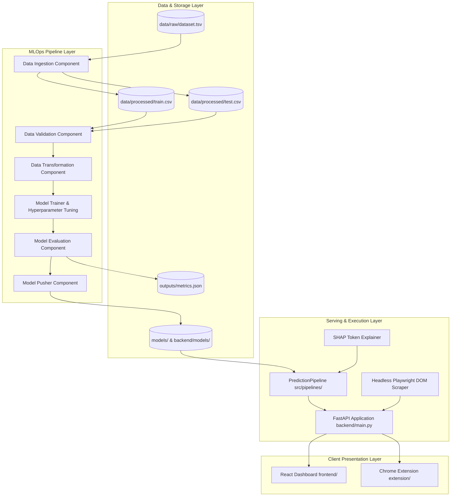
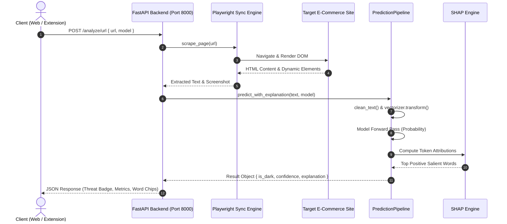

# 🏛️ DarkShield AI — System & Machine Learning Architecture

**Document Version:** 2.0.0  
**Target Platform:** Web, Cloud, Chrome Extension  
**Primary Tech Stack:** Python 3.10+, PyTorch, Scikit-Learn, SHAP, FastAPI, Playwright, React, Vite  

---

## 1. High-Level Architecture Blueprint

DarkShield AI is engineered as an end-to-end, decoupled MLOps system comprising four core layers:
1. **MLOps Core & Training Pipeline:** Automated data ingestion, schema validation, transformation, hyperparameter tuning, evaluation, and model pushing.
2. **Inference & Serving Subsystem:** High-throughput FastAPI REST API with Playwright headless DOM extraction and SHAP token attribution.
3. **Web Intelligence Dashboard:** React Single Page Application styled with the Sentinel Amber design system.
4. **Client Extension Layer:** Chromium Manifest V3 browser extension for instant tab inspection.



---

## 2. Subsystem Architectures

### 2.1 MLOps & Training Subsystem (`src/`)
Built with strict adherence to industry-standard component decoupling:
- **`src/config/config.yaml` & `schema.yaml`:** Declarative specifications for paths, hyperparameters, split ratios, and column constraints.
- **`src/components/data_ingestion.py`:** Loads raw TSV data, ensures immutability in `data/raw/`, and executes stratified 80/20 train/test splitting to prevent class imbalance skew.
- **`src/components/data_validation.py`:** Validates column existence, datatypes, missing value constraints, and binary target labels.
- **`src/components/data_transformation.py`:** Normalizes raw text (lowercasing, URL removal, HTML stripping, whitespace collapsing) and fits `TfidfVectorizer` **strictly** on the training split to avoid data leakage.
- **`src/components/feature_engineering.py`:** Manages sequence representations, sublinear TF scaling, and PyTorch `DataLoader` batch generation.
- **`src/components/model_trainer.py`:** Executes 5-fold cross-validated GridSearch for classical models (Logistic Regression, SVM) and epoch/learning-rate/hidden-dim search for neural sequence models (LSTM, GRU).
- **`src/components/model_evaluation.py`:** Evaluates models on unseen test observations, producing comparative metrics, 2x2 confusion matrix grids, and ROC curves.
- **`src/components/model_pusher.py`:** Atomically validates and copies best tuned models into `backend/models/` for immediate production inference.

---

### 2.2 Deep Sequence Neural Network Architecture
The PyTorch `DeepSequenceModel` supports both LSTM and GRU sequence mechanisms:

```
Input TF-IDF Vector (Dim = 1000)
             │
             ▼
      Linear Layer (1000 ➔ Hidden Dim [32/64])
             │
             ▼
      ReLU Activation + Dropout (p=0.2)
             │
             ▼
      Unsqueeze Dimension (Batch, 1, Hidden Dim)
             │
             ▼
      Recurrent Layer (LSTM or GRU, batch_first=True)
             │
             ▼
      Extract Last Hidden State h_t
             │
             ▼
      Classification Head (Linear Hidden Dim ➔ 1)
             │
             ▼
      Sigmoid Activation ➔ Deception Probability P(Y=1)
```

---

### 2.3 Serving & Live Scraper Architecture
Live URL auditing requires extracting rendered DOM content dynamically:
- **Playwright Sync Engine:** Runs headless Chromium in synchronous worker threads within FastAPI, bypassing JavaScript single-page rendering blocks and avoiding Windows asyncio selector event loop conflicts.
- **DOM Text Sanitizer:** Extracts visible body text, removes script/style tags, collapses whitespaces, and strips non-informational boilerplate.
- **Dynamic Checkpoint Loading:** The inference pipeline dynamically inspects PyTorch state dictionaries (`fc1.weight.shape[0]`) to automatically load models regardless of tuned hidden dimensions.

---

### 2.4 Explainability Architecture (SHAP Engine)
To prevent "black-box" decision making:
- **Linear Models (LR & SVM):** Computes exact linear feature attribution vector:
  $$\phi_i = w_i \cdot x_i$$
  where $w_i$ is the trained model weight and $x_i$ is the TF-IDF feature value for word $i$.
- **Deep Sequence Models (LSTM & GRU):** Utilizes `shap.DeepExplainer` with a zero-background reference tensor, setting `check_additivity=False` to handle non-linear recurrent activation gradients.
- **Present-Word Salience Filtering:** Filters feature attributions to tokens that physically occur in the target input document ($x_i > 0$), preventing unassociated zero-value artifacts from displaying.

---

## 3. End-to-End URL Audit Sequence



---

## 4. Deployment Topology & Containerization

The system is fully containerized via `Dockerfile` for deployment across local workstations, virtual machines, or container orchestration platforms:

```text
               ┌────────────────────────────────────────────────────────┐
               │                     Client Browser                     │
               │  [React Web App: Port 5173]   [Chrome Extension (MV3)] │
               └───────────────────────────┬────────────────────────────┘
                                           │ HTTP Requests
                                           ▼
               ┌────────────────────────────────────────────────────────┐
               │             Docker Container / Host Server             │
               │                                                        │
               │   FastAPI (Uvicorn) : Port 8000                        │
               │   ├── Playwright Browser Engine (Chromium)             │
               │   ├── PyTorch Recurrent Runtimes (CPU / CUDA)          │
               │   ├── Scikit-Learn Classical Classifiers               │
               │   └── SHAP Explainability Engine                       │
               └────────────────────────────────────────────────────────┘
```

---

## 5. Security, Resilience & Scalability Principles

1. **Sandboxed Headless Execution:** All remote URL scraping executes within ephemeral Chromium browser contexts with image rendering disabled for maximum throughput.
2. **CORS Isolation:** Backend middleware configured with granular HTTP verb permissions.
3. **Deterministic Seed Management:** All training and splitting pipelines use fixed random seeds (`random_state=42`) ensuring complete experimental reproducibility.
4. **Graceful Fallbacks:** If SHAP gradient attribution encounters operator warnings, the system gracefully falls back to token attribution rankings without crashing the request.
