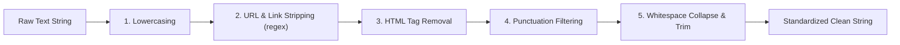

# 📖 DarkShield AI — Data Dictionary & Feature Specification

**Document Version:** 2.0.0  
**Corpus:** `ec-darkpattern` E-Commerce Deceptive Design Dataset  
**Raw Data Path:** `data/raw/dataset.tsv`  
**Processed Splits:** `data/processed/train.csv`, `data/processed/test.csv`  

---

## 1. Raw Dataset Schema (`dataset.tsv`)

The raw dataset is a tab-separated values (`.tsv`) file containing labeled e-commerce interface snippets collected from real-world online shopping platforms.

| Field Name | Data Type | Nullable | Primary Key | Description & Examples |
| :--- | :---: | :---: | :---: | :--- |
| **`page_id`** | Integer / String | Yes | No | Identifier representing the source e-commerce page or retail domain (e.g., `1012`, `158`). |
| **`text`** | String | No | No | Visible textual content extracted from the web element or UI snippet (e.g., *"FLASH SALE \| LIMITED TIME ONLY Shop Now"*). |
| **`label`** | Integer | No | No | Binary target classification label:<br>• `0`: Not Dark Pattern (Benign e-commerce UI)<br>• `1`: Dark Pattern (Deceptive UI element) |
| **`Pattern Category`** | String | Yes | No | Qualitative categorization of the deceptive strategy employed (e.g., `Urgency`, `Scarcity`, `Misdirection`, `Social Proof`). |

---

## 2. Target Class & Category Taxonomies

### 2.1 Target Variable (`label`)

```text
Target Distribution (N = 2,363 total records):
├── Class 0 (Not Dark Pattern):  1,185 observations (50.15%)
└── Class 1 (Dark Pattern):      1,178 observations (49.85%)
```

### 2.2 Category Definitions (`Pattern Category`)

| Category | Definition & Strategic Intent | Realistic E-Commerce Example |
| :--- | :--- | :--- |
| **`Urgency`** | Imposes an artificial or exaggerated deadline on the user to accelerate purchase decisions before critical thinking occurs. | *"Offer expires in 04:59 minutes! Claim discount now!"* |
| **`Scarcity`** | Fabricates or highlights limited inventory/capacity to induce fear of missing out (FOMO). | *"Hurry! Only 2 items left in stock!"*, *"In high demand."* |
| **`Misdirection`** | Uses visual hierarchy, emotional guilt, or confusing language to steer users away from optimal choices. | *"No thanks, I prefer paying full price for shoes."* (Confirmshaming) |
| **`Social Proof`** | Displays unverified peer activity, recent purchases, or viewership numbers to pressure the buyer into conformity. | *"Michael from London just purchased this hotel room 2 minutes ago!"* |
| **`Obstruction`** | Makes opting out, unsubscribing, or canceling services unnecessarily difficult or obscured. | Hiding cancellation buttons inside nested sub-menus. |
| **`Sneaking`** | Conceals extra charges, automatic subscription renewals, or adds unintended items to cart during checkout. | Pre-checked shipping insurance or hidden processing fees. |
| **`Forced Action`** | Requires users to disclose personal data or accept marketing communications as a precondition for a basic task. | *"Enter phone number to browse catalog."* |
| **`Not Dark Pattern`** | Standard, non-coercive informational text, shipping policies, standard customer service prompts. | *"100% Cotton Pillowcases & Shams"*, *"Write a review."* |

---

## 3. Data Transformation & Preprocessing Rules

All raw text strings pass through the `clean_text()` pipeline before vectorization:



1. **Case Normalization:** Converts all characters to lowercase (`text.lower()`).
2. **URL Stripping:** Removes standard HTTP/HTTPS links (`re.sub(r"https?://\S+|www\.\S+", " ", text)`).
3. **HTML Stripping:** Removes dangling DOM elements or angle brackets (`re.sub(r"<.*?>", " ", text)`).
4. **Punctuation Filtering:** Preserves alphanumeric characters, spaces, and salient financial symbols (`$`, `%`, `!`, `?`), removing noise characters.
5. **Whitespace Normalization:** Replaces tabs, newlines, and multiple spaces with a single space.

---

## 4. Feature Matrix Specifications (`TfidfVectorizer`)

The numerical feature space is generated using Scikit-Learn's `TfidfVectorizer`:

| Parameter | Configured Value | Rationale & Justification |
| :--- | :---: | :--- |
| **`max_features`** | `1000` | Restricts vocabulary to top 1,000 most informative unigrams and bigrams, preventing dimensionality curse and overfitting. |
| **`ngram_range`** | `(1, 2)` | Captures both single keywords (*"hurry"*, *"limited"*) and key multi-word phrases (*"left in stock"*, *"flash sale"*). |
| **`sublinear_tf`** | `True` | Replaces raw frequency $tf$ with $1 + \log(tf)$ to prevent highly repetitive words from distorting feature vectors. |
| **`stop_words`** | `"english"` | Removes standard non-discriminative English stop words (*"the"*, *"is"*, *"at"*). |

### Matrix Properties (Training Set):
- **Samples ($N$):** $1,884$
- **Features ($D$):** $1,000$
- **Sparsity:** $99.18\%$ zero values (typical and optimal for high-dimensional sparse text classification).
- **Persistence Path:** `models/vectorizer.pkl` (and synced to `backend/models/vectorizer.pkl`).
