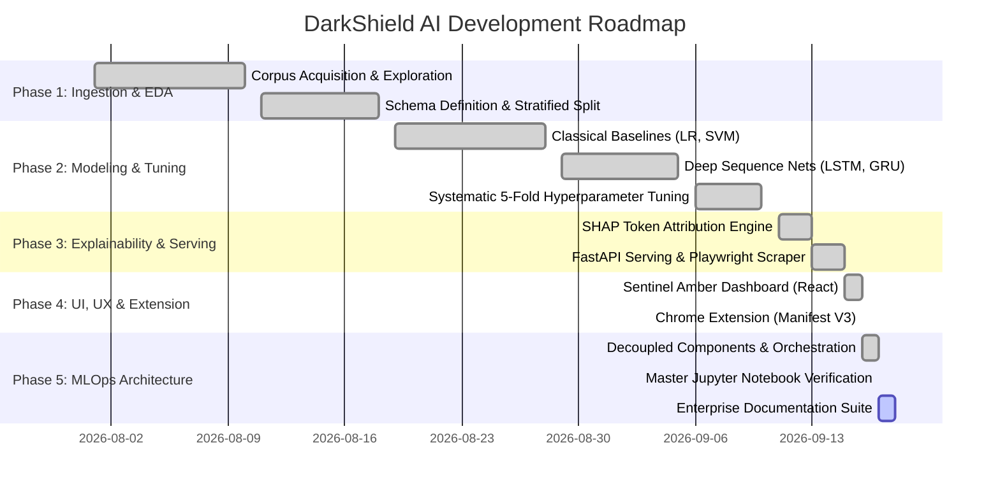

# 📅 DarkShield AI — Engineering & Development Plan

**Project Version:** 2.0.0  
**Methodology:** Iterative Agile / MLOps Lifecycle  
**Target Milestone Completion:** Academic Review & Production Readiness  

---

## 1. Development Phases & Milestones



---

## 2. Detailed Milestone Deliverables

### Phase 1: Data Ingestion, Schema & Validation (Completed)
- **Objective:** Establish clean, reproducible, immutable data pipelines.
- **Deliverables:**
  - Acquired and curated the `ec-darkpattern` corpus ($2,363$ e-commerce text samples).
  - Designed [schema.yaml](file:///c:/Users/laksh/Desktop/Black%20Pattern%20Detection/src/config/schema.yaml) defining column types and constraints.
  - Implemented [data_ingestion.py](file:///c:/Users/laksh/Desktop/Black%20Pattern%20Detection/src/components/data_ingestion.py) with stratified 80/20 train/test splitting.
  - Implemented [data_validation.py](file:///c:/Users/laksh/Desktop/Black%20Pattern%20Detection/src/components/data_validation.py) verifying zero nulls in required fields.

### Phase 2: Multi-Model Training & Hyperparameter Tuning (Completed)
- **Objective:** Implement and optimize diverse machine learning architectures.
- **Deliverables:**
  - Fitted `TfidfVectorizer` **strictly** on the training split ($1,000$ features, unigrams + bigrams, sublinear scaling).
  - Executed 5-fold cross-validated grid search for Logistic Regression ($C=10.0$) and Linear SVM ($C=1.0$).
  - Implemented PyTorch `DeepSequenceModel` exploring hidden dimensions, learning rates, and epochs for LSTM ($h=32$) and GRU ($h=64$).
  - Evaluated on hold-out test split, achieving F1-scores up to **95.03%** and ROC-AUC of **0.9774**.

### Phase 3: Explainability & Live Serving (Completed)
- **Objective:** Make predictions interpretable and expose real-time endpoints.
- **Deliverables:**
  - Integrated `SHAP` token attributions with present-word salience filtering.
  - Built FastAPI backend exposing `/analyze/url`, `/analyze/all`, `/analyze/image`, and `/predict`.
  - Implemented Playwright synchronous DOM scraping engine for headless extraction.

### Phase 4: Frontend Intelligence Dashboard & Extension (Completed)
- **Objective:** Deliver an intuitive, restrained user interface.
- **Deliverables:**
  - React SPA styled with the **Sentinel Amber** design system.
  - Chromium Manifest V3 browser extension with one-click page scanning.
  - Multi-resolution vector and raster favicons for cross-platform visual consistency.

### Phase 5: MLOps Decoupling, Master Notebook & Documentation (Current)
- **Objective:** Standardize repository layout according to industry MLOps best practices.
- **Deliverables:**
  - Reorganized into `src/components/`, `src/pipelines/`, `src/utils/`, `src/config/`.
  - Created and executed [end_to_end_dark_pattern_ml.ipynb](file:///c:/Users/laksh/Desktop/Black%20Pattern%20Detection/notebooks/end_to_end_dark_pattern_ml.ipynb) and companion notebooks.
  - Authored comprehensive documentation: PRD, Architecture, UI/UX, Requirements, Development Plan, Model Card, Data Dictionary, and API Reference.

---

## 3. Testing & Quality Assurance Strategy

```text
┌─────────────────────────────────────────────────────────────┐
│                 End-to-End User Verification                │
│     Live URL Scraping ➔ Prediction ➔ UI Visual Update       │
├─────────────────────────────────────────────────────────────┤
│                 API & Integration Testing                   │
│   FastAPI Endpoint Responses ➔ PyTorch / Scikit Inference   │
├─────────────────────────────────────────────────────────────┤
│                  Automated Unit Testing                     │
│   Schema Validation (pytest)  │  Pipeline Inference Tests   │
└─────────────────────────────────────────────────────────────┘
```

- **Unit Tests:** Located in `tests/test_data_validation.py` and `tests/test_model_inference.py`. Run via:
  ```bash
  python -m pytest tests/
  ```
- **Automated Continuous Integration:** Managed by `.github/workflows/ci.yaml` on every commit and pull request.
- **Notebook Pre-execution Verification:** Verified via `jupyter nbconvert --execute --ExecutePreprocessor.kernel_name=darkshield-venv`.

---

## 4. Git Branching & Versioning Policy

- **Branch Naming Conventions:**
  - `feature/<feature-name>`: New components or capabilities.
  - `fix/<issue-name>`: Bug fixes or model adjustments.
  - `docs/<doc-name>`: Documentation updates.
  - `mlops/<task-name>`: Pipeline, training, or serialization changes.
- **Semantic Versioning:** Follows `MAJOR.MINOR.PATCH` (currently `v2.0.0`).
- **Release Tagging:** Every production model push is tagged with training metadata and commit hash.

---

## 5. Model Retraining & Continuous Delivery Runbook

When new labeled dark pattern data is acquired:
1. Place new raw records into `data/raw/dataset.tsv`.
2. Run the automated training pipeline:
   ```bash
   python -m src.pipelines.training_pipeline
   ```
3. The pipeline will automatically:
   - Ingest and split data.
   - Run schema and null validation.
   - Re-fit the vectorizer on the new train split.
   - Re-tune hyperparameters across all 4 models.
   - Generate updated metrics and evaluation plots in `outputs/`.
   - Push the updated models into `backend/models/`.
4. Run `pytest tests/` to confirm backward-compatible inference.
5. Reload or restart the FastAPI service to serve the updated weights.
